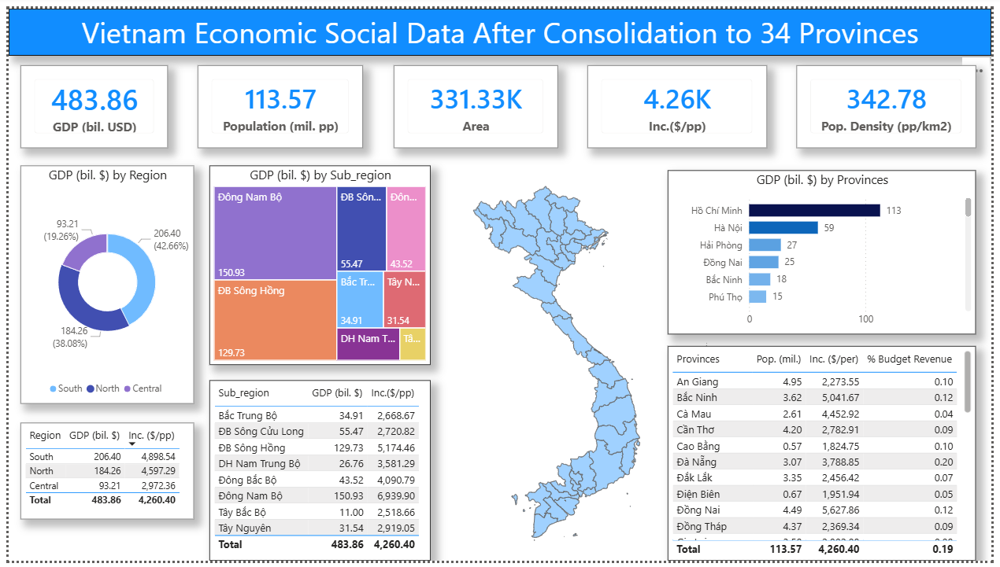

# Power BI Vietnam Economic Dashboard Tutorial
## After Provincial Consolidation to 34 Provinces

## Overview
This tutorial demonstrates creating a sophisticated, interactive economic and social dashboard for Vietnam using Power BI, based on the latest 2024 data showing the country's reorganization from 63 to 34 provinces. The dashboard features dynamic visualizations including shape maps, charts, and interactive filtering.

## Final Dashboard Features
- **5 KPI Cards**: GDP (billion USD), Population (millions), Area (km²), Income per capita (USD/person), Population density (people/km²)
- **Regional Analysis**: 3 regions (North, Central, South)
- **Sub-regional Analysis**: 8 geographical areas
- **Shape Map Visualization**: Interactive Vietnam map showing all 34 provinces
- **Province Rankings**: Bar charts by GDP
- **Detailed Tables**: Economic indicators by region and sub-region
- **Fully Interactive**: Click any region/area/province to filter all visuals

> Example outputs of the completed dashboard.

### Vietnam socio-economic dashboard after administrative merger: 34 provinces and municipalities stats



---

## DATA SOURCES

### Four Data Sources Required

#### 1. Map File (.json format)
**Purpose:** Display Vietnam shape map in Power BI
**Format:** TopoJSON format (required for Shape Map visual)
**Content:** Geographic boundaries of 34 consolidated provinces
**Note:** Includes Hoang Sa and Truong Sa archipelagos (though small on display)

#### 2. Excel File - 34 Provinces List
**Purpose:** Synchronize province names between map and data
**Sheet name:** Sheet1
**Column:** MAP_34
**Contains:** Exact province names matching the map file (34 provinces)
**Critical:** Names must match exactly for visualization to work

#### 3. Wikipedia Page 1 - Provincial Consolidation
**URL:** Wikipedia page on Vietnam administrative reform 2025
**Data tables extracted:**
- **Table 3:** Consolidation details (which old provinces merge into new ones)
- **Table 4:** Complete 34-province data including:
  - Province name
  - Area (km²)
  - Population
  - GDP 2024 (million VND)
  - Budget revenue
  - Income per capita
  - Rankings

**Examples of consolidation:**
- Tuyen Quang = Tuyen Quang + Ha Giang (merged)
- Lao Cai = Yen Bai + Lao Cai (merged)
- Hanoi = Hanoi + Ha Tay (remains, already merged previously)
- Ho Chi Minh City = HCMC + Binh Duong + Ba Ria-Vung Tau (merged)
- 11 provinces remain unchanged
- 23 provinces consolidated into new entities

#### 4. Wikipedia Page 2 - Regional Information
**URL:** Wikipedia page on Vietnam geographical regions
**Data table extracted:**
- 3 main regions: North, Central, South
- 8 sub-regions: Red River Delta, Northeast, Northwest, North Central Coast, South Central Coast, Central Highlands, Southeast, Mekong Delta
- Province assignments to each sub-region

---

## STEP-BY-STEP PROCESS

### Part 1: Initial Setup

#### Create New Power BI File
1. Open Power BI Desktop
2. File > Save As
3. Filename: "Vietnam Economic Social Dashboard After Consolidation"
4. Save regularly throughout process

#### Enable Shape Map Visual
**Critical step - must do first:**
1. File > Options and Settings > Options
2. Preview Features
3. Check "Shape Map visual"
4. Click OK
5. Restart Power BI if needed

**Why necessary:** Shape Map is preview feature, disabled by default

---

### Part 2: Loading Excel Data

#### Import 34 Provinces List

**Steps:**
1. Home tab > Excel Workbook
2. Browse to saved Excel file
3. Navigator window opens
4. Select "Sheet1" (contains MAP_34 column)
5. Click "Transform Data" (not Load)

**In Power Query Editor:**
1. Click on Sheet1 query
2. Click icon top-right: "Use First Row as Headers"
3. Verify: Column named "MAP_34" with 34 province names
4. Rename query: Right-click > Rename > "MAP_34"
5. Don't close yet - more data to load

**Purpose:** This establishes the master province name list that matches the map

---

### Part 3: Loading Shape Map

#### Import Map File

**Back in Power BI (not Power Query):**
1. Visualizations pane > Shape Map icon
2. Click on canvas to create shape map visual
3. Fields pane > Drag "MAP_34" to Location field

**Result:** Map appears but shows USA (default)

#### Configure Custom Map

**Fix to show Vietnam:**
1. Select shape map visual
2. Format pane > Map settings
3. Map type: Change from "USA by state" to "Custom map"
4. Browse > Navigate to downloaded .json map file
5. Select map file > Open

**Result:** Vietnam map with 34 provinces appears

---

### Part 4: Loading Web Data

#### Import Wikipedia Page 1 (Provincial Data)
[Sáp nhập tỉnh, thành Việt Nam 2025](https://vi.wikipedia.org/wiki/S%C3%A1p_nh%E1%BA%ADp_t%E1%BB%89nh%2C_th%C3%A0nh_Vi%E1%BB%87t_Nam_2025)

**Steps:**
1. Home tab > Get Data > Web
2. Paste Wikipedia URL (consolidation page)
3. Click OK
4. Navigator window shows all tables from webpage

**Select Tables:**
- **Table 2**: Check box (consolidation details)
- **Table 3**: Check box (provincial economic data)
- Click "Transform Data"

**In Power Query:**

**Rename Table 2:**
1. Right-click "Table 4" in Queries pane
2. Rename > "Province List"

**Rename Table 3:**
1. Right-click "Table 3"
2. Rename > "Provincial economic data"

#### Import Wikipedia Page 2 (Regional Data)
[List of regions of Vietnam](https://en.wikipedia.org/wiki/List_of_regions_of_Vietnam)

**In Power Query (don't close):**
1. New Source > Web
2. Paste Wikipedia URL (regions page)
3. Click OK
4. Navigator shows tables
5. Select "Regions of Vietnam" table
6. Click OK (loads into Power Query)

**Result:** Three queries in Power Query:
- Province (Table 4)
- Consolidation List (Table 3)
- Regions of Vietnam

---

### Part 5: Data Cleaning and Transformation

#### Clean Province Table

**Remove Unnecessary Columns:**
1. Select "Province" query
2. Hold Ctrl, click ranking columns (not needed)
3. Right-click > Remove Columns

**Rename Column:**
1. Double-click "Địa phương" column header
2. Rename to: "Tỉnh" (Province)

**Result:** Clean table with province names and economic data

#### Synchronize Province Names with MAP_34

**Critical task:** Province names must match exactly

**Merge to Compare:**
1. Select MAP_34 query
2. Home > Merge Queries
3. Select MAP_34 column
4. Merge with "Province" table
5. Select "Tỉnh" column
6. Click OK

**Expand to See Names:**
1. Click expand icon in merged column
2. Select only "Tỉnh"
3. Uncheck "Use original column name as prefix"
4. Click OK

**Find Mismatches:**
1. Look for "null" values
2. Filter > Unselect "(null)" to show only non-matches

**Two names don't match:**
- Ho Chi Minh City
- Thua Thien Hue

**Fix Ho Chi Minh City:**
1. Go to Province query
2. Find "TP. Hồ Chí Minh" (with TP. prefix)
3. Right-click on value
4. Replace Values
5. Find: "TP. Hồ Chí Minh"
6. Replace with: Copy exact name from MAP_34 ("Hồ Chí Minh")
7. Click OK

**Fix Thua Thien Hue:**
1. In Province query
2. Find "Huế" (short form)
3. Right-click > Replace Values
4. Find: "Huế"
5. Replace with: Copy exact name from MAP_34 ("Thừa Thiên Huế")
6. Click OK

**Verify:**
1. Return to MAP_34 query
2. Check merged column - all nulls gone
3. All 34 provinces matched!

**Clean up:**
1. Delete merged comparison column (not needed anymore)

---

### Part 6: Transform Regions Data

#### Handle Province Column (Multi-value Cells)

**Problem:** Provinces listed together in single cell, separated by line breaks

**Example cell content:**
```
Bà Rịa-Vũng Tàu
Bình Dương
TP. Hồ Chí Minh
```

**Solution - Split by Delimiter:**
1. Select Regions query
2. Right-click "Province" column
3. Split Column > By Delimiter
4. Choose "Custom"
5. **Critical:** Click "Advanced Options"
6. **Select "Rows"** (not Columns!)
7. Special Characters > Line Feed (LF)
8. Click OK

**Result:** Each province on separate row

**Why this works:**
- Line breaks are represented as LF (Line Feed)
- LF = `#(lf)` in Power Query
- Splitting by rows duplicates region/sub-region for each province

**Remove Duplicate Header:**
Row count shows 35 instead of 34 - one duplicate exists

1. Right-click Province column
2. Remove Duplicates
3. Verify: Now shows 34 rows

#### Clean Special Characters

**Problem:** Some province names have strange character at end

**Fix:**
1. Select province with weird character
2. Copy character (Ctrl+C)
3. Right-click Province column
4. Replace Values
5. Paste weird character in "Find"
6. Leave "Replace with" empty
7. Click OK

**Result:** Clean province names

#### Fill Down Region Column

**Problem:** Region column has blanks (merged cells in original)

**Fix:**
1. Right-click "Region" column
2. Fill > Down

**Result:** Every row now has region value

#### Clean Sub-Region Names

**Problem:** Sub-region has English text in parentheses
**Example:** "Đồng bằng sông Hồng (Red River Delta)"

**Want:** Just Vietnamese name

**Create Helper Column (Text.BetweenDelimiters):**
1. Add Column > Custom Column
2. Name: "Sub_Region"
3. Formula:
```powerquery
Text.BetweenDelimiters([Sub_Region], "(", ")", 0)
```

**Formula breakdown:**
- `Text.BetweenDelimiters()` - Extract text between delimiters
- `[Sub_Region]` - Source column
- `"("` - Start delimiter
- `")"` - End delimiter  
- `0` - Start from first occurrence

**Result:** Extracts only text inside parentheses (Vietnamese names)

**Clean Up:**
1. Delete old Sub_Region column
2. Rename helper column to "Sub_Region"

#### Shorten Sub-Region Names (Optional)

**For dashboard aesthetics:**

**Red River Delta:**
```powerquery
Replace Value: "Đồng bằng sông Hồng" → "SH" (Song Hong)
```

**South Central Coast:**
```powerquery
Replace Value: "Duyên hải Nam Trung Bộ" → "Nam Trung Bộ"
```

**Mekong Delta:**
```powerquery
Replace Value: "Đồng bằng sông Cửu Long" → "Sông Cửu Long"
```

**Other regions:** Keep as-is or shorten as desired

#### Shorten Region Names

**Replace Values:**
- "Bắc Trung Bộ và Duyên hải miền Trung" → "Miền Bắc" (North)
- "Nam Bộ" → "Miền Nam" (South)
- "Miền Trung" → "Miền Trung" (Central)

**Purpose:** Cleaner display on dashboard

---

### Part 7: Synchronize Regions with MAP_34

**Same process as Province table:**

#### Merge to Compare
1. Select MAP_34 query
2. Home > Merge Queries
3. Select MAP column
4. Merge with "Regions" table
5. Select "Province" column
6. Click OK

#### Expand and Check
1. Expand merged column
2. Select "Province" only
3. Click OK
4. Look for mismatches (null values)

**Two names don't match again (Wikipedia inconsistency):**
- Hồ Chí Minh (has "City" or different format)
- Thừa Thiên Huế (short form "Huế")

#### Fix in Regions Table

**Same replacement process:**

**Ho Chi Minh:**
1. Go to Regions query
2. Find "Hồ Chí Minh City"
3. Replace Values > "Hồ Chí Minh"

**Thua Thien Hue:**
1. Find "Huế"
2. Replace Values > "Thừa Thiên Huế"

#### Verify and Clean
1. Return to MAP_34
2. All 34 matched!
3. Delete comparison column

**Keep only three columns in Regions:**
1. Select Region, Sub_Region, Province columns
2. Right-click > Remove Other Columns

---

### Part 8: Finalize Power Query

#### Save All Changes
1. Home tab > Close & Apply
2. Wait for data to load into Power BI

**Verify in Data View:**
- Fields pane shows 4 tables
- MAP_34, Province, Regions, Consolidation List

---

### Part 9: Create Data Model (Relationships)

#### Understanding Relationships

**Purpose:** Connect tables so filters cascade

**Example:** 
- Click region → Filters provinces → Filters map
- Click province on map → Shows province data

#### Access Model View
1. Click "Model" icon (left sidebar)
2. Four tables visible

#### Create Relationships

**Relationship 1: Regions → Province**
1. Drag "Province" from Regions table
2. Drop on "Tỉnh" in Province table
3. Dialog opens:
   - Table 1: Regions, Column: Province
   - Table 2: Province, Column: Tỉnh
   - Cardinality: Many-to-One (automatically detected)
4. Click OK

**Relationship 2: MAP_34 → Province**
1. Drag "MAP" from MAP_34
2. Drop on "Tỉnh" in Province table
3. Click OK

**Relationship 3: MAP_34 → Regions**
1. Drag "MAP" from MAP_34
2. Drop on "Province" in Regions table
3. Click OK

**Result:** Star schema with Province as fact table

**Verify Relationships:**
- Lines connect tables
- Cardinality shows Many:1 or 1:Many
- Can right-click > Properties to modify

---

### Part 10: Create DAX Measures

#### Why Create Measures?

**Raw data issues:**
- GDP in million VND (huge numbers)
- Population in persons (also huge)
- Hard to read and display

**Solution:** Convert to readable units

#### Measure 1: GDP (Billion USD)

**Create Measure:**
1. Right-click MAP_34 table (or any table)
2. New Measure
3. Name and formula:

```DAX
GDP (Tỷ $) = 
SUM('Province'[GDP 2024 triệu đồng]) / 1000 / 24100
```

**Breakdown:**
- `SUM('Province'[GDP 2024 triệu đồng])` - Total GDP in million VND
- `/ 1000` - Convert million to billion
- `/ 24100` - Convert VND to USD (exchange rate Dec 2024)
- Result: GDP in billion USD

**Why exchange rate 24,100?**
- Data is from end of 2024
- Use exchange rate from that time
- Not current rate!

#### Measure 2: Population (Million People)

```DAX
Dân số (triệu người) = 
SUM('Province'[Dân số là người]) / 1000000
```

**Breakdown:**
- Sum all population
- Divide by 1 million
- Result: Population in millions

#### Measure 3: Income Per Capita (USD/person)

```DAX
Thu nhập ($/người) = 
[GDP (Tỷ $)] * 1000000000 / SUM('Province'[Dân số là người])
```

**Breakdown:**
- `[GDP (Tỷ $)]` - Reference existing measure
- `* 1000000000` - Convert billion back to units
- `/ SUM(...)` - Divide by total population
- Result: Income per person in USD

**Why multiply then divide?**
- GDP measure already in billions
- Need to convert to single dollars before dividing by people

#### Measure 4: Population Density

```DAX
Mật độ (người/km²) = 
SUM('Province'[Dân số là người]) / SUM('Province'[Diện tích])
```

**Breakdown:**
- Total population / Total area
- Result: People per square kilometer

#### Measure 5: Budget Revenue Percentage

```DAX
Phần trăm nộp ngân sách = 
SUM('Province'[Thu ngân sách triệu đồng]) / SUM('Province'[GDP 2024 triệu đồng])
```

**Breakdown:**
- Budget revenue / GDP
- Shows what % of GDP goes to government
- Both in same units (million VND) so units cancel

**Result:** Percentage value (will format as %)

---

### Part 11: Build Dashboard Layout

#### Create Title Bar

**Insert Rectangle:**
1. Insert tab > Shapes > Rectangle
2. Draw across top of canvas
3. Format Shape:
   - Fill: Blue or theme color
   - No outline

**Add Title Text:**
1. Insert > Text Box
2. Type: "Vietnam Economic Social Data After Consolidation to 34 Provinces"
3. Format:
   - Font size: 18pt
   - Bold
   - Center align
4. Position over rectangle

**Remove Text Box Background:**
1. Select text box
2. Format > Effects > Background: Transparent
3. Format > General > Border: None
4. Text color: White

---

### Part 12: Create KPI Cards

#### Card 1: GDP

**Insert Card:**
1. Visualizations > Card
2. Drag "GDP (Tỷ $)" to Fields

**Format Card:**
1. Select card
2. Format pane:

**Callout Value (large number):**
- Font size: 35pt
- Color: Blue (or theme color)
- Bold

**Category Label (title):**
- Text: "GDP"
- Font size: 14pt
- Bold
- Color: Blue

**Visual Border:**
- Effects > Visual border: On
- Rounded corners: 10
- Color: Blue

#### Duplicate for Other Cards

**Copy Card:**
1. Select GDP card
2. Ctrl+C
3. Ctrl+V four times
4. Arrange horizontally

**Card 2: Population**
- Remove GDP field
- Add "Dân số (triệu người)"
- Change color (different from GDP)

**Card 3: Area**
- Remove field
- Add "Diện tích" (Area)
- Rename: Right-click value > Rename > "Diện tích"
- Change color

**Card 4: Income**
- Add "Thu nhập ($/người)"
- Change color

**Card 5: Density**
- Add "Mật độ (người/km²)"
- Change color

#### Align Cards

1. Select all five cards (hold Shift)
2. Format tab > Align
3. Align Top (top edges aligned)
4. Format tab > Align
5. Distribute Horizontally (equal spacing)

---

### Part 13: Create Regional Visualizations

#### Donut Chart: GDP by Region

**Insert Donut Chart:**
1. Visualizations > Donut Chart
2. Configuration:
   - Legend: "Region" (from Regions table)
   - Values: "GDP (Tỷ $)"

**Format:**
- Title: "GDP (Tỷ $)"
- Legend position: Bottom Center
- Data labels: On, show value and percentage
- Visual border: Rounded corners 10

**Result:** Shows 3 regions (North, Central, South) with GDP distribution

#### Table: Region Details

**Insert Table:**
1. Visualizations > Table
2. Fields:
   - Region
   - GDP (Tỷ $)
   - Thu nhập ($/người)

**Format:**
- Visual border: Rounded corners 10
- Grid: Horizontal lines
- Header: Bold

---

### Part 14: Create Sub-Regional Visualizations

#### Treemap Chart: GDP by Sub-Region

**Why Treemap?**
- Shows 8 sub-regions clearly
- Size = GDP amount
- Easy to compare visually

**Insert Treemap:**
1. Visualizations > Treemap
2. Configuration:
   - Group: "Sub_Region"
   - Values: "GDP (Tỷ $)"

**Format:**
- Title: "GDP (Tỷ $)"
- Data labels: On
- Format data as Decimal, 1 decimal place
- Visual border: Rounded corners 10

**Result:** Colored boxes sized by GDP

#### Table: Sub-Region Details

1. Duplicate region table (Ctrl+C, Ctrl+V)
2. Replace "Region" field with "Sub_Region"
3. Position below treemap

---

### Part 15: Shape Map with Province Data

#### Add Values to Shape Map

**Current state:** Map shows provinces but no data

**Add GDP to Map:**
1. Select shape map visual
2. Drag "GDP (Tỷ $)" to Size field

**Result:** 
- Province areas sized by GDP
- Larger area = Higher GDP
- Ho Chi Minh City = Largest
- Western provinces = Smallest

**Format Map:**
1. Format pane > Data colors
2. Choose color scheme
3. Format pane > Map settings
4. Adjust zoom/position if needed

---

### Part 16: Create Province Bar Chart

#### Bar Chart: GDP by Province

**Insert Clustered Bar Chart:**
1. Visualizations > Clustered Bar Chart
2. Configuration:
   - Y-axis: "Tỉnh" (Province)
   - X-axis: "GDP (Tỷ $)"

**Sort Descending:**
1. More options (...) > Sort by > GDP (Tỷ $)
2. Descending

**Result:** All 34 provinces ranked by GDP

**Format:**
- Title: "GDP"
- Data labels: On, outside end
- Y-axis: Hide title
- X-axis: Hide title (clear from context)
- Bars: Yellow color
- Visual border: Rounded corners 10
- Format values: Decimal, 1 decimal place

#### Province Table

**Insert Table:**
1. Visualizations > Table
2. Fields:
   - Province
   - GDP (Tỷ $)
   - Dân số (triệu người) - Renamed to "DS"
   - Phần trăm nộp ngân sách - Format as Percentage, 1 decimal

**Format:**
- Visual border: Rounded corners 10
- Grid lines
- Header: Bold

---

### Part 17: Testing Interactivity

#### Test Region Filter

**Click on Region:**
1. Click "Miền Bắc" (North) in donut chart
2. **All visuals update:**
   - KPI cards show North totals
   - Map highlights northern provinces
   - Sub-region treemap shows only northern sub-regions
   - Province bar chart shows only northern provinces

**Multi-select Regions:**
1. Hold Ctrl
2. Click multiple regions
3. Data combines

**Clear Filter:**
- Right-click > Clear selection

#### Test Sub-Region Filter

**Click on Sub-Region:**
1. Click "Đồng bằng sông Hồng" (Red River Delta)
2. All visuals filter to just that sub-region
3. Map highlights only those provinces

#### Test Province Selection

**Click on Map:**
1. Click any province on map
2. All visuals show that province data only

**Click in Table:**
1. Click province name in table
2. Same result - all visuals filter

**Click in Bar Chart:**
1. Click any bar
2. Province filters applied

---

## COMPLETE DAX FORMULAS

### Primary Measures

**GDP (Billion USD):**
```DAX
GDP (Tỷ $) = 
SUM('Province'[GDP 2024 triệu đồng]) / 1000 / 24100
```

**Population (Million People):**
```DAX
Dân số (triệu người) = 
SUM('Province'[Dân số là người]) / 1000000
```

**Income Per Capita (USD/person):**
```DAX
Thu nhập ($/người) = 
[GDP (Tỷ $)] * 1000000000 / SUM('Province'[Dân số là người])
```

**Population Density (people/km²):**
```DAX
Mật độ (người/km²) = 
SUM('Province'[Dân số là người]) / SUM('Province'[Diện tích])
```

**Budget Revenue Percentage:**
```DAX
Phần trăm nộp ngân sách = 
SUM('Province'[Thu ngân sách triệu đồng]) / SUM('Province'[GDP 2024 triệu đồng])
```

---

## POWER QUERY M FORMULAS

### Extract Text Between Delimiters

**Sub-Region Name Extraction:**
```powerquery
Text.BetweenDelimiters([Sub_Region], "(", ")", 0)
```

**Parameters:**
- `[Sub_Region]` - Source column
- `"("` - Start delimiter
- `")"` - End delimiter
- `0` - Start from first character

---

## KEY CONCEPTS EXPLAINED

### Shape Maps in Power BI

**Requirements:**
1. Enable preview feature in Options
2. Custom .json/.topojson file
3. Location field matches map identifiers exactly

**Format: TopoJSON**
- Geographical boundary data
- Reduces file size vs GeoJSON
- Industry standard for web mapping

### Data Model Relationships

**Star Schema:**
- Fact table: Province (economic data)
- Dimension tables: Regions, MAP_34
- Relationships: Many-to-One

**Benefits:**
- Cross-filtering between tables
- Click anywhere, update everywhere
- Efficient calculation

### DAX vs Power Query

**Power Query (M):**
- Data transformation
- Column operations
- One-time data prep
- Runs on refresh

**DAX:**
- Calculations on model
- Dynamic aggregations
- Responds to filters
- Runs on interaction

---

## DESIGN BEST PRACTICES APPLIED

### Color Scheme
**Consistent theme:**
- Blue: Primary color (title, cards)
- Yellow: Accent (bar charts)
- Varied colors: Regions/sub-regions for distinction
- White: Text on dark backgrounds

### Layout Principles
1. **Top tier:** KPIs (most important metrics)
2. **Second tier:** Regional breakdown
3. **Third tier:** Sub-regional detail
4. **Fourth tier:** Provincial rankings
5. **Interactive:** Click to drill down

### Visual Hierarchy
- Largest: Map (central focus)
- Medium: Charts and cards
- Smallest: Tables (detailed data)

### User Experience
- One-click filtering
- Multi-select capability (Ctrl+click)
- Clear filter button
- Consistent formatting
- No clutter

---

## TROUBLESHOOTING COMMON ISSUES

### Map Shows Wrong Location
**Problem:** Map displays USA instead of Vietnam

**Solution:**
- Map settings > Custom map
- Browse to .json file
- Ensure file is valid TopoJSON format

### Provinces Don't Highlight on Map
**Problem:** Click province, nothing happens

**Solution:**
- Check relationship exists: MAP_34 ↔ Province
- Verify province names match exactly
- Case-sensitive! "Hanoi" ≠ "Hà Nội"

### Data Doesn't Filter
**Problem:** Click region, other visuals don't update

**Solution:**
- Verify relationships in Model View
- Check relationship cardinality is correct
- Ensure common column has matching values

### Measure Shows Wrong Value
**Problem:** GDP shows millions instead of billions

**Solution:**
- Check formula: Should divide by 1000
- Verify exchange rate (24100 for Dec 2024)
- Use SUM() aggregation function

### Shape Map Not Available
**Problem:** Can't find Shape Map in Visualizations

**Solution:**
- File > Options > Preview Features
- Check "Shape Map visual"
- Click OK and restart Power BI

---

## CUSTOMIZATION IDEAS

### Additional Measures
- GDP growth rate (if historical data available)
- GDP per capita
- Budget revenue per capita
- Urbanization rate
- Economic diversity index

### Additional Visualizations
- Line chart: GDP trends over time
- Scatter plot: Population vs GDP
- Waterfall chart: GDP composition
- Heat map: Economic indicators matrix

### Enhanced Interactivity
- Year slicer (if multi-year data)
- Province search box
- Bookmarks for preset views
- Drill-through pages for province details
- Tooltips with additional metrics

### Data Enhancements
- Add province capitals
- Include major cities within provinces
- Economic sector breakdown (agriculture/industry/services)
- Employment data
- Education statistics
- Healthcare indicators

---

## DATA QUALITY NOTES

### Wikipedia Data Accuracy

**Pros:**
- Recent (2024 data)
- Comprehensive
- Regularly updated
- Structured tables

**Cons:**
- Sometimes inconsistent naming
- May have errors
- Not official government source

**Recommendation:**
- Verify critical numbers with official sources
- Cross-check population figures
- Confirm consolidation details
- Update as new data becomes available

### Consolidation Impact

**34 vs 63 Provinces:**
- Data aggregates multiple old provinces
- Some historical comparisons invalid
- New administrative structure
- Economic indicators redistributed

**Examples:**
- Ho Chi Minh City now includes Binh Duong + Ba Ria-Vung Tau
- Much larger economy and population
- Comparisons with old HCMC data not valid

---

## MAINTENANCE WORKFLOW

### Regular Updates

**Monthly:**
1. Check Wikipedia for data updates
2. Refresh Power BI data source
3. Verify calculations still valid

**Quarterly:**
1. Review exchange rates
2. Update income per capita calculations
3. Check for new provinces/changes

**Annually:**
1. Update full year GDP data
2. Recalculate all percentage measures
3. Archive previous year's dashboard

### Data Refresh Process

**Update source data:**
1. Open Power BI file
2. Home > Refresh
3. Wait for update
4. Verify no errors

**Update exchange rates:**
1. Edit measure formula
2. Change exchange rate value
3. Close & Apply

---

## REAL-WORLD APPLICATIONS

### Use Cases

**Government Planning:**
- Resource allocation by region
- Infrastructure investment priorities
- Regional development strategies

**Business Intelligence:**
- Market sizing by province
- Target customer identification
- Expansion location analysis

**Economic Analysis:**
- Regional disparity assessment
- Growth pattern identification
- Urbanization trends

**Education:**
- Teaching Vietnamese geography
- Economic education
- Data visualization examples

---

## LEARNING OUTCOMES

### Skills Demonstrated

**Data Skills:**
1. Web scraping from Wikipedia
2. Data cleaning and standardization
3. Name matching and reconciliation
4. Data modeling with relationships

**Power BI Skills:**
1. Custom shape map implementation
2. DAX measure creation
3. Interactive filtering setup
4. Professional dashboard design

**Analytical Skills:**
1. Economic indicator calculation
2. Cross-regional comparison
3. Visual storytelling
4. Insight generation

---

## ADVANCED ENHANCEMENTS

### Power BI Service Publishing

**Steps:**
1. File > Publish
2. Select workspace
3. Share with stakeholders
4. Set up scheduled refresh

### Mobile Optimization

**Create phone layout:**
1. View > Mobile Layout
2. Drag visuals to phone canvas
3. Resize for mobile screen
4. Test on phone app

### Row-Level Security (RLS)

**Restrict by region:**
```DAX
[Region] = USERNAME()
```

**Use case:** Regional managers see only their region

---

*This Power BI dashboard demonstrates advanced data integration, transformation, and visualization skills, creating a comprehensive economic overview of Vietnam's post-consolidation administrative structure. The interactive design enables dynamic exploration of economic and social indicators across the country's 34 provinces.*

